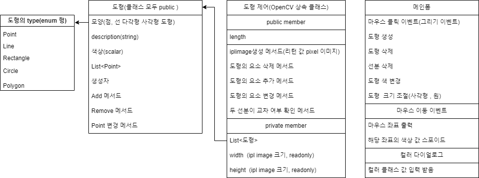

## 클래스 도식
##### 도형의 type
* Point (점 기본 생성시 초기 값)
* Line (점이 2개 이상시)
* Ractangle (점 4개 로 구성, 90도만 허용)
* Circle (중심점에서 테두리까지 거리가 모두 같은 형태)
* Polygon (점 3개 이상으로, 각도와 점의 갯수가 다양한 형태)

##### 도형 클래스
* 모양을 정의 할 변수 enum 형
* descripition 은 string으로 선언, 메인 폼에서 리스트 박스 아이템 이름으로 사용
* 도형의 색상 값을 저장할 변수 C# 의 기본 클래스 중 Color(scalar) 클래스가 있음
* 점의 좌표값들을 저장해둘 List 클래스
* Add 메서드는 그리기 이벤트시 호출 됨
* Remove 메서드는 삭제 이벤트시 호출 됨 
* Point 변경 메서드는 도형 이동 이벤트 시 호출 됨

##### 도형 제어
* length 도형 클래스의 인스턴스 저장해둔 List의 크기
* OpenCV 클래스를 상속 받아 정의
* 도형 클래스를 리스트로 갖고 있음
* width ipl 이미지 가로 크기
* height ipl 이미지의 세로 크기 
* 기타 메서드는 논의 필요

##### 메인 폼
* 사전 조사 했던 워드 파일로 대체
* 코딩 작성 중 추가 논의 필요
